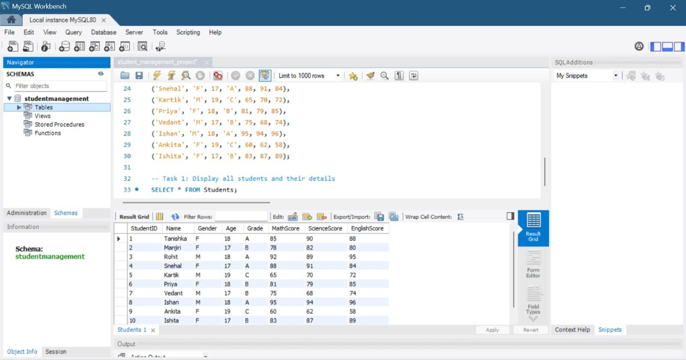
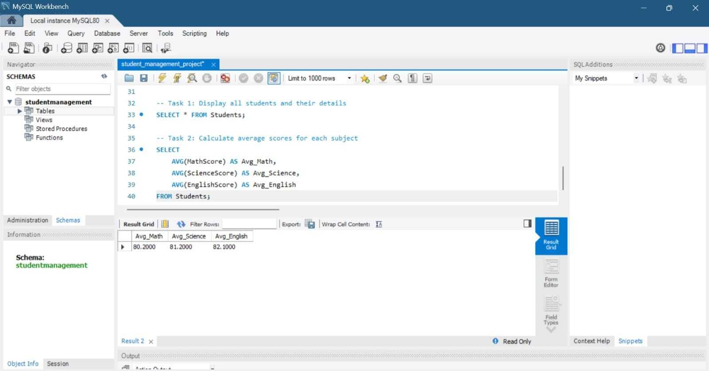
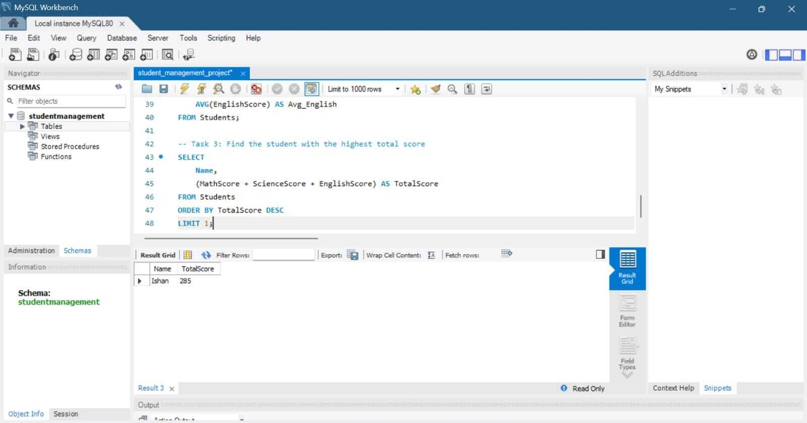
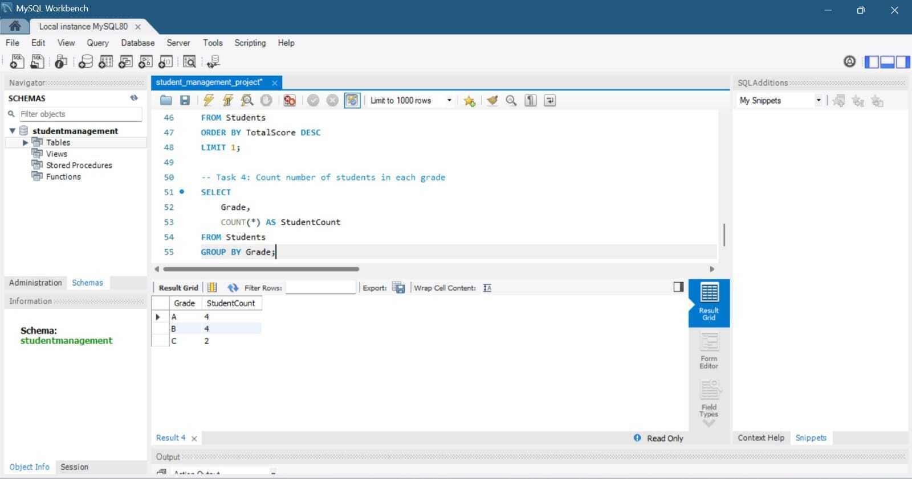
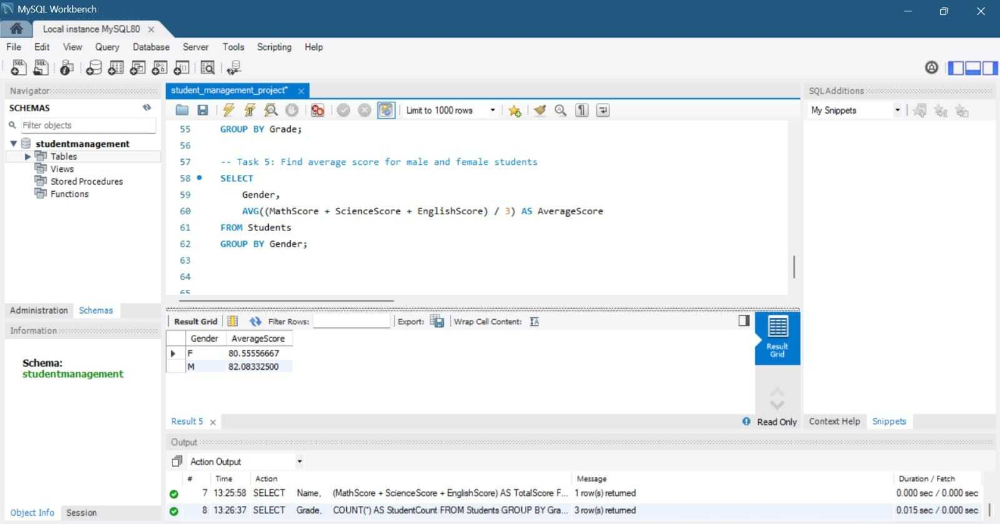
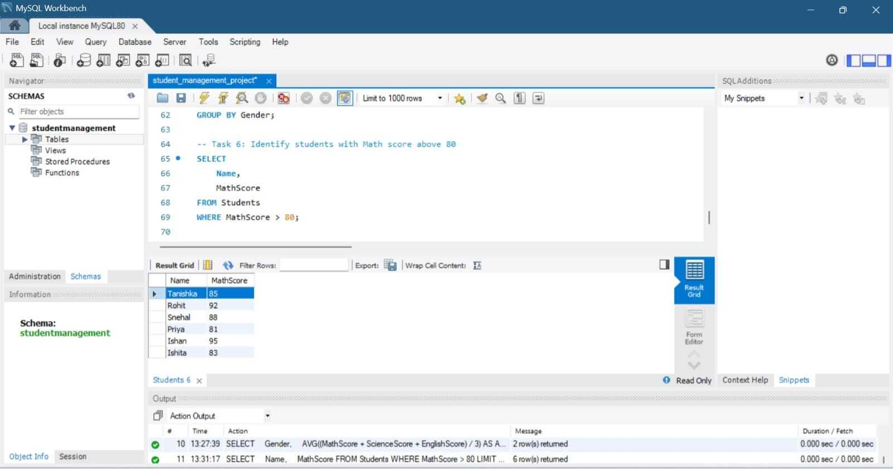
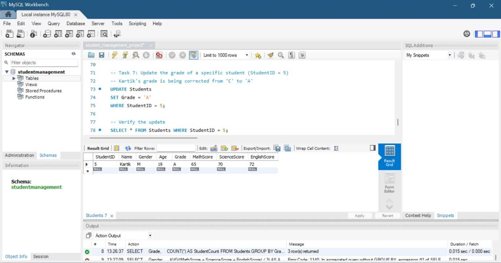

# Student Management System using SQL

## Project Overview
This project shows a Student Management System built using SQL. It includes database creation, table relationships, data insertion, and query operations for managing student records.

## Features
- Database creation
- Table relationships
- Data insertion and retrieval
- SQL queries
- Student record management

## Technologies Used
- SQL
- MySQL / SQL Server

## Project File
- `student_management_project.sql`

## Screenshots

### Task 1 - All Students

### Task 2 - Average Scores

### Task 3 - Top Scorer

### Task 4 - Grade Count

### Task 5 - Gender Average

### Task 6 - Math Above 80

### Task 7 - Update Grade

